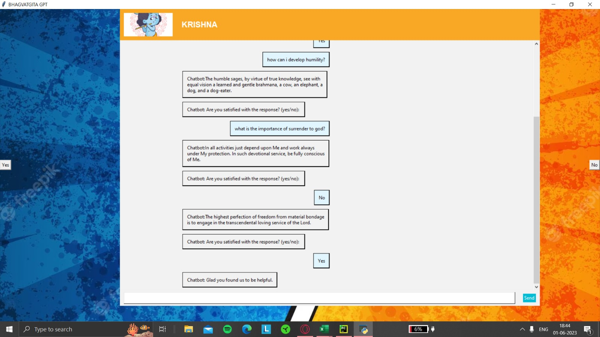

# BhagwatGITA-GPT
BhagwadGitaGPT is a chatbot capable of providing responses derived from the ancient Indian scripture, the Bhagwad Gita. The chatbot utilizes a machine learning algorithm based on cosine similarity to analyze user queries and generate relevant and meaningful responses based on the teachings of the Bhagwad Gita.

**Salient Features:**

* Prompt-based Dialogue​

* Reacts To User Feedback​

* Ability To Handle Absurd Inputs​

* Feedback Logging

**Environment:**

Install the following libraries in your Python environment:

* Pandas

* PIL

* Numpy 

* Scikit-learn

* Tkinter

**How to use:**

* Run BGPT.py to get a Tkinter interface.

* Insert your prompt in the chatbot and subsequently get a response.

* Press the yes/no button to indicate your satisfaction with the response

* The chatbot will ask for another prompt or give you another response depending on the feedback

